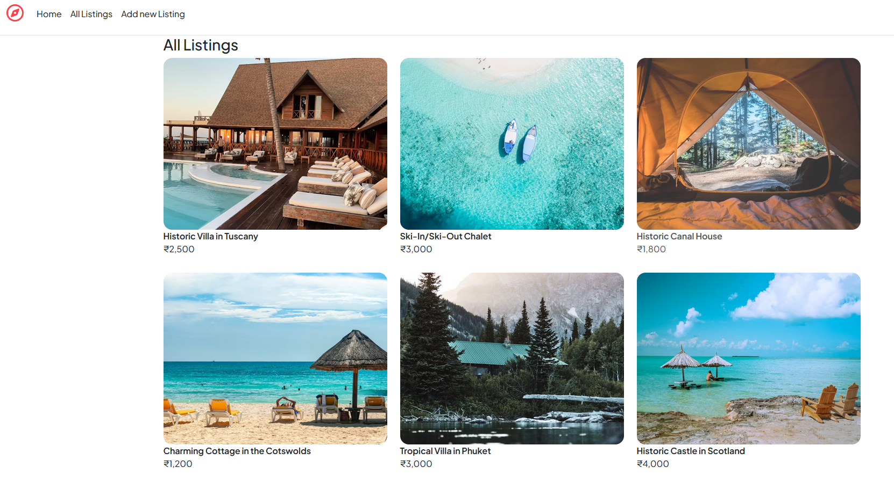

# 🧑‍💻 Suresh's Modern Portfolio

Welcome to my modern portfolio! This project showcases my skills, projects, and passion for web development. Built with **Next.js**, **React**, and **Tailwind CSS**.

---

## 🚀 Features

- ✨ Beautiful, responsive design
- 🕒 Live local time display
- 🧑‍💻 Hero section with animated typewriter effects
- 📂 Projects section with interactive cards
- 🌙 Light/Dark mode toggle
- 🔗 Social media dock


## 🛠️ Getting Started

1. **Clone the repository:**
   ```bash
   git clone https://github.com/uniquepatel01/portfolio-suresh.git
   cd portfolio-suresh
   ```

2. **Install dependencies:**
   ```bash
   npm install
   ```

3. **Run the development server:**
   ```bash
   npm run dev
   ```

4. **Open [http://localhost:3000](http://localhost:3000) to view it in your browser.**

---

## 🖼️ Screenshots

| Home (Hero) | Projects |
|-------------|----------|
|  |  |

---

## 📦 Built With

- [Next.js](https://nextjs.org/)
- [React](https://react.dev/)
- [Tailwind CSS](https://tailwindcss.com/)
- [Lucide Icons](https://lucide.dev/)

---

## 🙋‍♂️ About Me

Hi, I'm **Suresh** – a passionate full-stack developer who loves building meaningful web apps and turning bold ideas into real-world solutions.

- [Twitter](https://twitter.com/uniquepatel01)
- [GitHub](https://github.com/uniquepatel01)
- [LinkedIn](https://linkedin.com/in/uniquepatel01)
- [Instagram](https://instagram.com/uniquepatel01)

---

## 📄 License

This project is licensed under the MIT License.

---

> Made with ❤️ by Suresh
